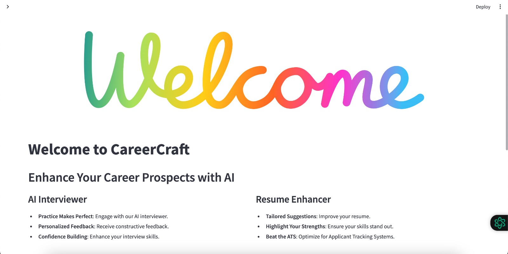
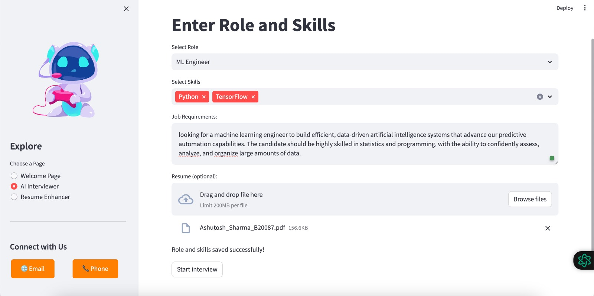
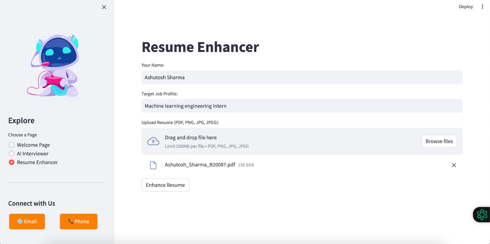

# CareerCraft - AI-Powered Career Enhancement WebApp


Welcome Screen of our Webapp

Welcome to CareerCraft, your personal career companion designed to elevate your job-seeking journey. Our web application leverages the Mixtral LLM API to provide you with a comprehensive suite of tools, including a Virtual Interview Simulator and a Resume Enhancer. Whether you're a student preparing for real interviews or a professional looking to polish your resume, CareerCraft is here to guide you.

**Access our Website here: [Make Your Career Now!](https://careercraft.streamlit.app/)**

## Features:

### 1. Virtual Interview Simulator
- **Job Profile Selection:** Choose your target job profile from a list of available options.
- **Skills Input:** Specify the relevant skills for your chosen job profile.
- **Resume Upload:** Upload your resume to personalize the virtual ◊interview experience.
- **AI-Generated Questions:** Experience realistic interview scenarios as the AI generates relevant questions based on your chosen job profile and skills.◊
- **Performance Feedback:** Receive constructive feedback to help you improve your interview skills and increase your chances of success in real-world interviews.


*The AI Interviewer Screen*

### 2. Resume Enhancer
- **Resume Upload:** Submit your resume for analysis.
- **Target Job Profile:** Specify the job profile you are targeting.
- **Strengths and Weaknesses Analysis:** Get a detailed analysis of your resume, highlighting strengths and weaknesses against the target job profile.
- **Enhanced Resume Output:** Receive an improved, simplified version of your resume, tailored to impress potential employers.


*Resume Enhancer Screen*

## Technical Setup:

### Setting Environment Variables

Before running the application, include the following environment variables:

```bash
export OPENAI_API_KEY='your_openai_api_key'
export MIXTRAL_API_KEY='your_mixtral_api_key'
```

### Local Setup

To run CareerCraft locally, follow these steps:

1. **Clone Repository:**
   ```bash
   git clone git@github.com:yashcode00/sparkathon-ai-2k24.git
   ```

2. **Navigate to AI_hackathon Directory:**
   ```bash
   cd AI_hackathon
   ```

3. **Create Conda Environment:**
   ```bash
   conda create --name sparkathon
   ```

4. **Install Requirements:**
   ```bash
   pip3 install -r requirements.txt
   ```

5. **Run Streamlit Application:**
   ```bash
   streamlit run home.py
   ```

6. **Access Localhost:**
   Open your web browser and go to [localhost:8501](http://localhost:8501) to explore CareerCraft.

## Thanks and Regards